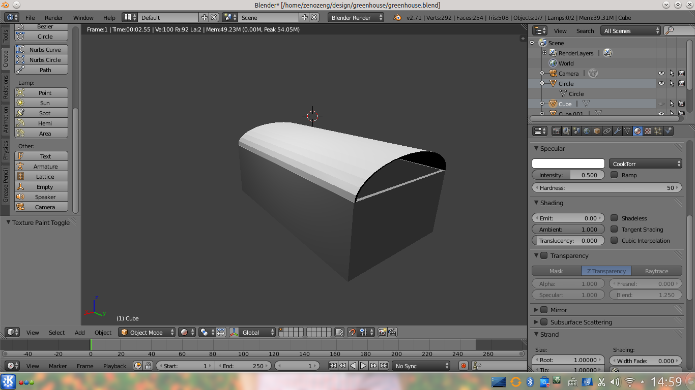

# Try-blender

## Keywords

- Bool Modifier

- Extract

## Shortcuts

- (edit mode) e -- exapand

- C-r add links for wall

- (edit mode) 限制仅 z 轴移动

## 材料

- 钢管

    60 * 100 * 3000

- 水泥

## Links

- [演示：用Blender制作建筑效果图](http://www.micro-bridge.com/news/news.asp?id=1457)

- [Blender 3D︰从入门到精通](http://zh.wikibooks.org/wiki/Blender_3D%EF%B8%B0%E5%BE%9E%E5%85%A5%E9%96%80%E5%88%B0%E7%B2%BE%E9%80%9A)g

- [Blender 3D: Noob to Pro](http://en.wikibooks.org/wiki/Blender_3D:_Noob_to_Pro)

- [ngPlant - Open Source plant modeling suite](http://ngplant.sourceforge.net/)

- [Blender 2.59 Modeling Tutorial, Modeling Walls & Rooms Quickly](http://www.youtube.com/watch?v=5QXD_twk4gw)
